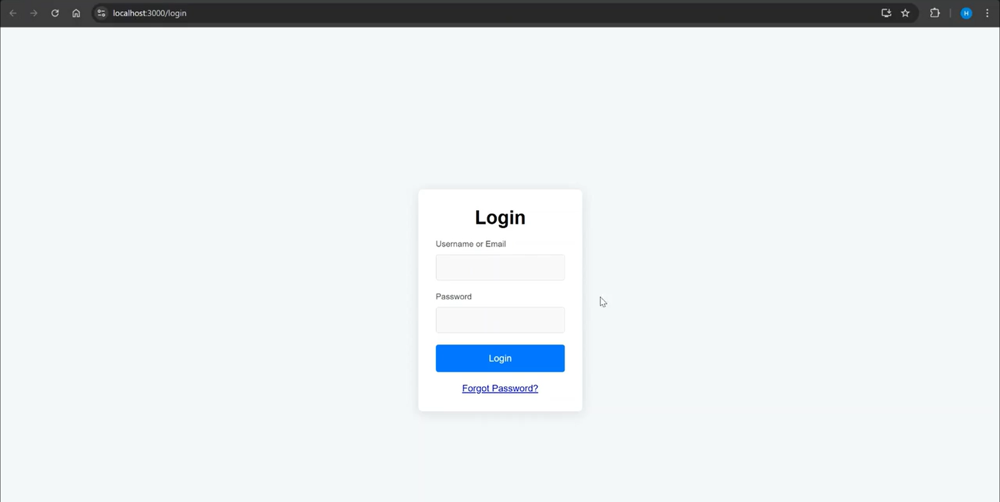
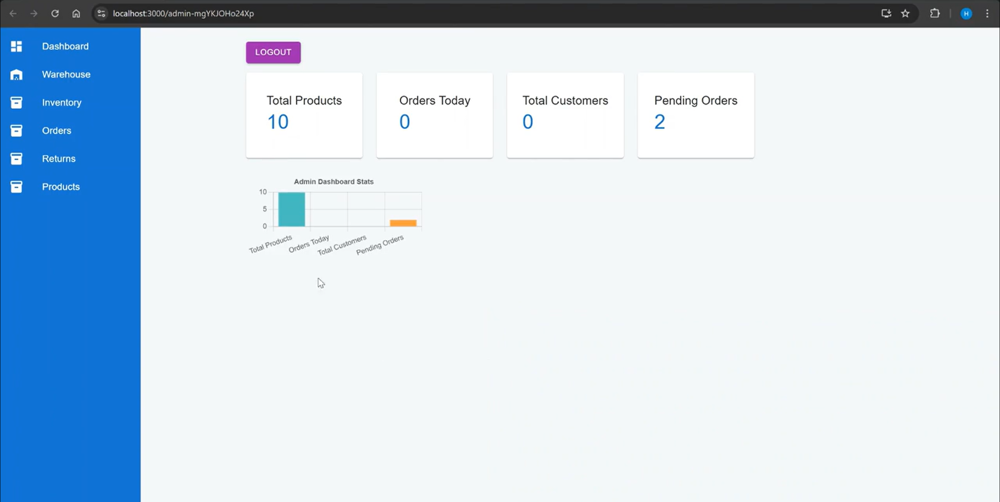

# Gaming Console Ecommerce

This repository includes a gaming consoles ecommerce website built using Flask, React, and MySQL. The secure web app incorporates threat modeling to identify risks, implementing features like HTTPS enforcement, JWT-based authentication, RBAC, 2FA, activity logging, secure error handling, account lockout, and protections against SQL injection, XSS, and file upload vulnerabilities.

## Table of Contents

- [Gaming Console Ecommerce](#gaming-console-ecommerce)
  - [Table of Contents](#table-of-contents)
  - [Installation](#installation)
    - [Prerequisites](#prerequisites)
    - [Installation Steps](#installation-steps)
      - [React Setup](#react-setup)
      - [Flask Setup](#flask-setup)
  - [Running the Codes](#running-the-codes)
    - [Running React Frontend](#running-react-frontend)
    - [Running Flask Backend](#running-flask-backend)
  - [Description](#description)
  - [Features](#features)
  - [Limitations and Possible Enhancements](#limitations-and-possible-enhancements)
    - [Limitations](#limitations)
    - [Enhancements](#enhancements)
  - [Sample Pictures](#sample-pictures)

## Installation

### Prerequisites

- **Node.js**: Required for the React frontend. Download and install from the [Node.js official website](https://nodejs.org/).
- **Python 3.x**: Required for the Flask backend.
- **MySQL**: Database for storing ecommerce data.
- **Pip**: Python package installer.

### Installation Steps

#### React Setup

1. **Install Node.js**  
   Download and install Node.js from [https://nodejs.org/](https://nodejs.org/).

2. **Install React Dependencies**  
   Navigate to the React project directory and run:

   ```bash
   npm install
#### Flask Setup
1. **Install Flask Dependencies**
Navigate to the Flask project directory and run:
```bash
pip install -r requirements.txt
```
## Running the Codes
### Running React Frontend
Navigate to your React project directory and start the development server:
```bash
npm start
```
The React app will typically run on `http://localhost:3000`.

### Running Flask Backend
Navigate to your Flask project directory and start the Flask server (adjust the command if your main file is named differently):
```bash
python app.py
```
The Flask app will typically run on `http://localhost:5000`.

## Description
The Gaming Console Ecommerce platform is a secure web application that provides a complete online shopping experience for gaming consoles. It leverages a modern tech stack:

* React for a responsive, dynamic user interface.
* Flask for a robust, secure backend API.
* MySQL for reliable data storage.
* The system is designed with security in mind, including HTTPS enforcement, JWT-based authentication, Role-Based Access Control (RBAC), two-factor authentication (2FA), comprehensive activity logging, secure error handling, account lockout mechanisms, and robust protections against SQL injection, Cross-Site Scripting (XSS), and file upload vulnerabilities.

## Features
1. User Authentication & Authorization
* JWT-based authentication for secure session management.
* Role-Based Access Control (RBAC) to restrict functionalities based on user roles.
* Two-Factor Authentication (2FA) for an additional layer of security.
* Account lockout mechanism to prevent brute force attacks.

2. Secure Communication
* HTTPS enforcement to encrypt data in transit.
* Secure error handling to avoid information leakage.

3. Injection Mitigation
* SQL injection prevention through parameterized queries.
* XSS prevention by sanitizing user inputs.
* File upload security checks to mitigate malicious file execution.

4. User Experience
* Responsive React frontend for an engaging and dynamic user interface.
* Fast and interactive product browsing and checkout process.
* Real-time updates and notifications for order statuses.

5. Admin and Activity Logging
* Detailed logging of user activities for auditing and troubleshooting.
* Administrative dashboards for monitoring sales, inventory, and user activities.

6. Ecommerce Essentials
* Product catalog management.
* Shopping cart functionality.
* Secure payment integration.
* Order tracking and history.
## Limitations and Possible Enhancements
### Limitations
* Security Protocols: Currently, while HTTPS is enforced, further security hardening (such as HSTS, Content Security Policy, etc.) could be implemented.
* Scalability: The current architecture is designed for moderate traffic; high loads may require further optimization and load balancing.
* Testing Coverage: Automated testing (unit, integration, and end-to-end tests) may be limited, affecting the rapid identification of potential issues.
### Enhancements
* Implement HTTP Strict Transport Security (HSTS) and Content Security Policy (CSP) headers.
* Regular security audits and penetration testing.
* Use of more robust frameworks or tools for vulnerability scanning.
* Integrate load balancing and caching mechanisms.
* Optimize database queries and consider database sharding or replication for high traffic.
* Implement asynchronous processing for long-running tasks.
* Develop comprehensive unit, integration, and end-to-end tests.
* Incorporate continuous integration/continuous deployment (CI/CD) pipelines.
* Add monitoring tools (e.g., Prometheus, Grafana) to track application performance and errors.

## Sample Pictures


